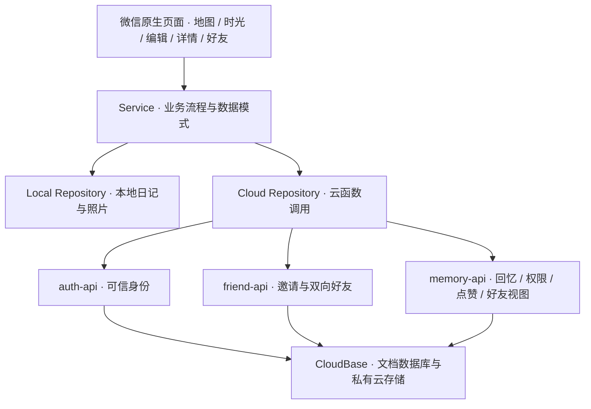

# iSDU · 校园交互平台

> 把校园变成一张会生长的记忆星图。

以山东大学中心校区为场景的微信原生小程序：**把照片与文字留在故事发生的地点，再通过地图、时间轴和经授权的好友分享重新发现校园生活。**

**空间日记 · 地图交互 · 隐私可控的好友共享**

[项目与技术导读](docs/PROJECT_GUIDE.md) · [本地运行](docs/MANUAL_SETUP.md) · [比赛介绍 PPT](https://github.com/MiniDiva8/iSdu/releases/tag/competition-v2) · [文档导航](docs/README.md)

<p align="center">
  
</p>

<p align="center"><sub>项目实际使用的校园插画底图（1448 × 1086）；交互层在其上承载选点、缩放与回忆标记。此图为地图素材展示。</sub></p>

## 为什么做这个项目

校园中的一次活动、一段心情或一张照片，同时具有“时间”和“地点”。iSDU 把这两个维度连接起来：**地图回答“故事发生在哪里”，时间轴回答“那时发生了什么”。**

| 使用场景                 | 项目提供的体验                                                 |
| ------------------------ | -------------------------------------------------------------- |
| 想留下某个校园地点的故事 | 拖动地图选点，记录 1–3 张照片、文字、地点、心情与时间          |
| 想回顾一段校园生活       | 在地图上寻找回忆，或按月份浏览、搜索，并跳回发生的位置         |
| 想与熟悉的人分享         | 邀请双方确认成为 iSDU 好友，选择仅自己、指定好友或全部好友可见 |
| 想知道好友最近的校园故事 | 浏览好友近 24 小时地图与历史好友时光，查看详情并点赞           |

回忆默认私密。好友关系由用户主动建立，不读取微信好友列表、通讯录或 GPS。

## 值得关注的技术工作

| 工程问题                                     | 实现思路                                                                            | 源码入口                                                                                                                              |
| -------------------------------------------- | ----------------------------------------------------------------------------------- | ------------------------------------------------------------------------------------------------------------------------------------- |
| 缩放、拖动和换屏后，如何保持选点与标记一致？ | 使用 `[0, 1]` 比例坐标；根据实际渲染矩形计算准星位置；地图与标记共用变换容器        | [坐标计算](miniprogram/utils/map-coordinates.ts) · [测试](miniprogram/utils/map-coordinates.test.mjs)                                 |
| 共享后撤回权限，旧访问还能否读取内容？       | 云函数从可信上下文取得身份，每次检查可见范围和当前好友关系；指定好友授权绑定关系 ID | [回忆权限](cloudfunctions/memory-api/lib/memory-handler.js) · [测试](cloudfunctions/memory-api/lib/memory-handler.test.cjs)           |
| 本地日记迁移到云端时，如何处理部分失败？     | 迁移默认私密，保留本地副本；上传后回读核验，全部成功才切换云端主数据                | [迁移服务](miniprogram/services/memory-migration-service.ts) · [云端读写](miniprogram/services/repository/cloud-memory-repository.ts) |
| 如何让地图、时间轴和好友视图共用业务能力？   | 页面经 Service / Repository 访问数据；本地持久化与云端实现分开，纯逻辑可独立测试    | [业务服务](miniprogram/services/memory-service.ts) · [Repository](miniprogram/services/repository)                                    |

这些工作串起了**交互设计、坐标建模、数据持久化、服务端授权与自动化验证**。设计取舍和阅读顺序见 [项目与技术导读](docs/PROJECT_GUIDE.md)。

## 架构概览



**技术栈：** TypeScript · WXML / WXSS · TDesign MiniProgram · CloudBase · Node.js 原生测试 · ESLint / Prettier。

云端身份来自 `cloud.getWXContext()`。跨用户业务数据经云函数鉴权，图片在权限检查后签发短期访问地址。

## 版本与验证范围

**本首页展示默认分支 `codex/social-v2` 的 Social V2。** 导师直接打开仓库即可查看，无需切换到 `main`。

| 版本                | 定位与证据                                                                                                                                                                                                                 |
| ------------------- | -------------------------------------------------------------------------------------------------------------------------------------------------------------------------------------------------------------------------- |
| V1 · 个人空间日记   | 地图记录、照片持久化与回顾闭环；历史基线保留在 [`4f517e9`](https://github.com/MiniDiva8/iSdu/commit/4f517e9)                                                                                                               |
| V2 · 好友共享       | 当前展示版本；已有 [比赛展示 Release 与 PPT](https://github.com/MiniDiva8/iSdu/releases/tag/competition-v2)。仓库 [2026-08-28 记录](docs/STATUS.md#好友时光列表2026-08-28)载明真实双账号好友邀请、授权地图和好友时光已验证 |
| V3 · 圈子与热点探索 | 后续开发方向，涉及主动公开、圈子时间线与热点地图；不属于本默认分支的已交付功能                                                                                                                                             |

2026-09-12 对本展示副本执行 `npm run check`：**135 项自动测试通过**，类型、Lint、格式与安全扫描通过。双账号实测与平台验收分别记录，详见 [版本与验证说明](docs/PROJECT_GUIDE.md#版本与验证说明)。

## 本地运行

需要 Node.js `^22.15.0` 或 `>=24`、npm `>=10`，以及微信开发者工具。

```sh
git clone --branch codex/social-v2 --single-branch https://github.com/MiniDiva8/iSdu.git
cd iSdu
npm ci
npm run check
```

Windows PowerShell 如限制 `npm.ps1`，使用 `npm.cmd ci` 与 `npm.cmd run check`。

在微信开发者工具中导入**仓库根目录**，执行“工具 → 构建 npm”后编译。首次使用从本地记录开始；好友与云端备份需要自行配置 CloudBase。完整步骤、AppID 配置与常见问题见 [运行手册](docs/MANUAL_SETUP.md)。

## 仓库怎么读

```text
miniprogram/
  pages/           地图、时光、编辑、详情、好友等页面
  models/          日记、好友、坐标与云端数据类型
  services/        业务流程、本地文件处理与 Repository
  utils/           坐标、筛选、统计等纯逻辑
  assets/          校园地图等静态资源
cloudfunctions/
  auth-api/        可信身份与账号
  friend-api/      邀请与好友关系
  memory-api/      回忆、共享权限、点赞与好友查询
scripts/           测试支持与安全扫描
docs/              技术设计、运行说明与验收记录
```

想快速了解项目，可先看 [项目与技术导读](docs/PROJECT_GUIDE.md)；想深入某个模块，可按 [文档导航](docs/README.md)进入。测试与对应实现相邻，统一由 `npm run check` 执行测试、类型检查、Lint、格式检查与敏感信息扫描。

## 素材与使用说明

本项目用于作品展示与学习交流，不代表学校官方服务。TDesign MiniProgram、微信云开发 SDK 等第三方组件的来源与许可证见 [第三方说明](docs/THIRD_PARTY_NOTICES.md)。

项目自身当前为 `UNLICENSED`，公开可读不等于授予复制、修改、再发布或商业使用许可。校园地图由项目所有者提供并经过处理，其生成过程、源文件和比赛使用权仍需单独归档；仓库不对地图素材授予再利用许可。
